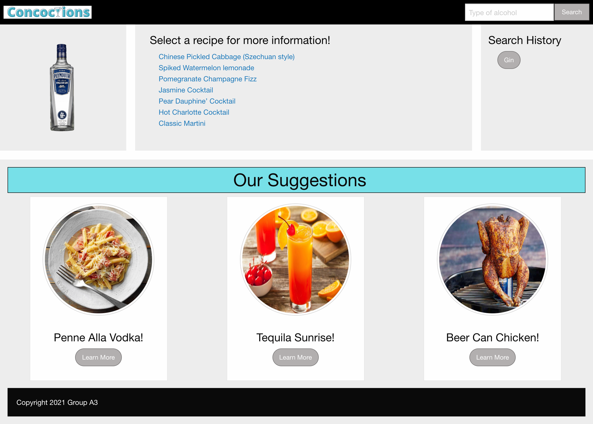

# Concoctions App  (Project - One)

This web application allows you to enter a favorite type of alcohol in a search field and return a variety of drink and food recipe options, incorporating the user input of alcohol type from multiple API's.

## User Story and Motivation:

Are you a food and drink enthusiast who likes to try new things, but doesn't want to sift through a ton of websites for a desired recipe? Do you feel like you are stuck in a routine of serving the same drink or food item and are looking to liven up your next event with some creative options? Do you get frustrated googling your favorite type of alochol and getting back endless lists of blogs that you don't have time to read through?  

This app provides a solution to this repetitive routine and endless blog search results in a single place. Our app simplifies your search process, providing simple and quick informaton to narrow down results of food and drink recipes into a short list. This list provides links to the ingredients needed and instructions of how to make the drink or food item.

We wanted to design an app that would appeal to a wide variety of people and multiple circumstances, broaden user horizons with a wider variety of ways to use the alcohol of their choice, and create exciting, new food and drink experiences.

<b>CSS Framework Used:</b>

Foundations

<b>Technologies Used:</b>

<ul>
<li>HTML</li>
<li>CSS</li>
<li>JavaScript</li>
<li>jQuery</li>
<li>VS Code</li>
<li>Postman</li>
</ul>

<b>API References:</b>

<ul>
<li>Spoonacular</li> 
<li>Recipe Puppy </li>
<li>Cocktail DB </li>
</ul>

## App Details:

Application that pulls a list of drink and food recipes with user inputed alcohol as an ingredient. This generated list provides links to the ingredients required and instructions to make the selected item. 

On the bottom of the page, there are pre-populated food and drink items suggested by the app creators.

## How to Use:
Input an alcohol type, then click search and it retuns a list of food and drink recipes using the ingredient provided - these are all clickable links to recipes in a variety of sites.

## Links:

live app:
https://glchavez.github.io/Project-One/

Repo: 
https://github.com/glchavez/Project-One

## Future Development Ideas:

<ol>
<li>Add sorting feature to separate drinks and food.</li>
<li>Add weather app and suggest drink and food items that fit the current weather conditions.</li>
<li>Add links to highlighted distilleries or breweries, wineries, etc for specific alcohol types.</li>
<li>Add random search feature to make the suggestions at the bottom changeable marketing links to various sponsored alcohol manufacturers.</li>
</ol>